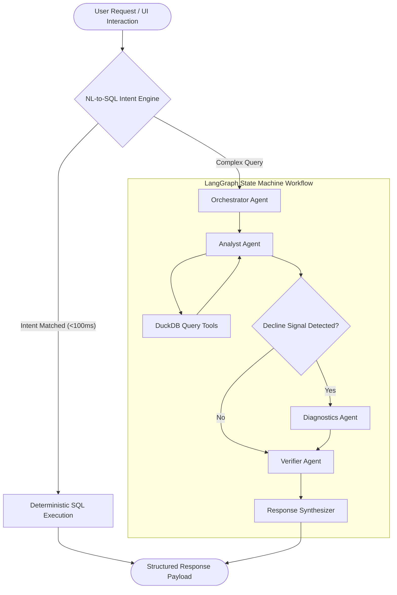

# QuickBite Intelligence

> Executive-grade agentic decision-support engine for Quick Service Restaurant (QSR) enterprise analytics.

QuickBite Intelligence is a high-throughput, evidence-first analytics platform engineered for QSR enterprise management. It combines deterministic analytical querying via **DuckDB**, stateful agentic orchestration using **LangGraph**, natural language intent synthesis via **Groq LLM (`llama-3.3-70b-versatile`)**, and an executive dashboard constructed with **React** and **Tailwind CSS**.

The architecture strictly decouples **quantitative calculation** from **natural language synthesis**, ensuring zero statistical hallucination and deterministic reproducibility across all business intelligence operations.

---

## Technical Highlights & Standout Features

### 1. Sub-100ms Deterministic Natural Language to SQL Engine
* **Module**: `backend/tools/nl_to_sql.py`
* **Mechanism**: Executes regex-based intent classification and entity extraction across 10+ query categories, compiling parameterized SQL for direct execution against embedded DuckDB.
* **Performance**: Sub-100ms execution latency with 0% LLM hallucination risk for standard business queries.

### 2. Multi-Store Comparative Analysis Engine
* **Module**: `backend/tools/comparison.py` | `frontend/src/pages/PerformanceView.jsx`
* **Mechanism**: Performs side-by-side performance evaluation across arbitrary store clusters. Computes a weighted **Performance Score Index (0–100)** incorporating net revenue, order volume, Average Order Value (AOV), and Month-over-Month (MoM) growth velocity alongside gap-to-best benchmarking.

### 3. Smart Interventional Recommendation Engine
* **Module**: `backend/tools/recommendations.py`
* **Mechanism**: Evaluates operational data (rejection rates, channel shifts, category contribution) to synthesize 3–5 prioritized, actionable interventions with estimated financial impact (INR and %), timeline, effort classification, success probability, and risk profiles.

### 4. The Time Machine Slider (Interactive Causality Engine)
* **Module**: `backend/tools/time_machine.py` | `frontend/src/components/TimeMachineSlider.jsx`
* **Mechanism**: Filmstrip-based timeline controller allowing real-time temporal scrubbing across monthly frames with ghost overlays for period-over-period delta visualization and dynamic AI insight re-synthesis.

### 5. Interactive Dimension Filter & Drill-Down Engine
* **Module**: `frontend/src/components/FilterPanel.jsx`
* **Mechanism**: Multi-select dimension filtering across City, Channel, Store Format, and Date Range with breadcrumb state tracking and client-side saved filter views.

### 6. Persistent Live Trend Tracker
* **Module**: `frontend/src/components/TrendTracker.jsx`
* **Mechanism**: Sticky executive metric bar rendering real-time business KPIs with embedded Recharts sparklines, period change indicators, and modal expansion capabilities.

### 7. Google Gemini & macOS Spotlight AI Command Bar
* **Module**: `frontend/src/components/SpotlightBar.jsx`
* **Mechanism**: Floating bottom-right AI action bar (`⌘K` / `Ctrl+K`) with smooth spring physics unwrap animations, 360° rotation micro-interactions, and 3-second auto-collapse timers.

---

## System Architecture



---

## Project Context Index: Files by Topic

This project is organized so that an evaluator can quickly locate the relevant code by responsibility instead of reading the entire repository.

### 1) API entrypoints & app runtime
- `backend/app.py` — FastAPI server, health endpoints, overview/product routes, and database bootstrap logic.
- `backend/config.py` — environment configuration for API keys and model selection.
- `scripts/ingest_dataset.py` — ETL pipeline that loads the Excel dataset into DuckDB.
- `scripts/generate_pdf.py` and `generate_architecture_pdf.py` — export/report generation utilities for documentation and architecture artifact creation.

### 2) Agent orchestration and reasoning flow
- `backend/agents/orchestrator.py` — orchestrator agent; classifies natural-language questions into supported analytical intents and resolves date ranges.
- `backend/agents/graph.py` — LangGraph workflow definition; links orchestrator → analyst → diagnostics → verifier → synthesizer.
- `backend/agents/analyst.py` — analyst node; calls the deterministic analytical tools based on the chosen intent.
- `backend/agents/diagnostics_agent.py` — diagnostic node; interprets declining-store data and summarizes likely drivers.
- `backend/agents/verifier.py` — verification node; checks analytical results before synthesis.
- `backend/agents/synthesizer.py` — final response builder that converts verified metrics into structured output.

### 3) Deterministic data tools and business analytics logic
- `backend/tools/nl_to_sql.py` — rule-based natural-language to SQL intent mapping and parameter extraction.
- `backend/tools/revenue.py` — total revenue, order volume, and AOV calculations.
- `backend/tools/stores.py` — store rankings and consistently declining store detection.
- `backend/tools/channels.py` — channel-level performance breakdowns.
- `backend/tools/products.py` — top SKUs and category/product revenue analysis.
- `backend/tools/cities.py` — city revenue trend and decline analysis.
- `backend/tools/periods.py` — weekday/weekend and festive/normal comparison analysis.
- `backend/tools/diagnostics.py` — deep metrics for root-cause analysis on declining stores.
- `backend/tools/recommendations.py` — intervention suggestions and action planning.
- `backend/tools/comparison.py` — comparative benchmarking across stores or dimensions.
- `backend/tools/time_machine.py` — temporal analytics and historical navigation support.

### 4) Data layer, schemas, and utility helpers
- `backend/data/database.py` — DuckDB connection manager and query executor.
- `data/qsr.duckdb` — embedded analytics database used for production queries.
- `backend/models/schemas.py` — Pydantic request/response schemas for API contracts.
- `backend/utils/dates.py` — date helpers for last-N-month selections and time-window resolution.

### 5) Frontend app and user experience layer
- `frontend/src/App.jsx` — main app shell and route wiring.
- `frontend/src/pages/OverviewView.jsx` — executive overview dashboard screen.
- `frontend/src/pages/PerformanceView.jsx` — performance comparison and benchmark views.
- `frontend/src/pages/StoresView.jsx` — store-level insights and diagnostics.
- `frontend/src/pages/ProductsView.jsx` — product and SKU analysis.
- `frontend/src/pages/ChannelsView.jsx` — channel performance analysis.
- `frontend/src/pages/IntelligenceView.jsx` — AI-driven analytical insights and narratives.
- `frontend/src/components/FilterPanel.jsx` — filters and drill-down controls.
- `frontend/src/components/TimeMachineSlider.jsx` — time-scrub view for historical analysis.
- `frontend/src/components/TrendTracker.jsx` — KPI trend bar and live signal tracking.
- `frontend/src/components/SpotlightBar.jsx` — AI command bar and interactive launcher.
- `frontend/src/components/Sidebar.jsx` — left navigation and dashboard structure.
- `frontend/src/services/api.js` — calls to the backend APIs.

### 6) Evaluation / project trace: where to start reading
If you are evaluating the project in a focused way, start here:
1. `backend/agents/orchestrator.py` — question interpretation and intent routing.
2. `backend/agents/graph.py` — execution path of the LangGraph pipeline.
3. `backend/agents/analyst.py` — which tool gets executed for each intent.
4. `backend/tools/*.py` — deterministic calculation logic and SQL-based business metrics.
5. `backend/agents/diagnostics_agent.py` and `backend/agents/verifier.py` — reasoning and validation layer.
6. `backend/app.py` — API surface and live dashboard integration.
7. `frontend/src/pages/` and `frontend/src/components/` — end-user analytics interface.

### 7) High-level responsibility map
- Intent routing: `backend/agents/orchestrator.py`
- Execution graph: `backend/agents/graph.py`
- Analytics retrieval: `backend/agents/analyst.py`
- Root-cause explanation: `backend/agents/diagnostics_agent.py`
- Verification: `backend/agents/verifier.py`
- Final output structure: `backend/agents/synthesizer.py`
- Business calculations: `backend/tools/`
- Database access: `backend/data/database.py`
- API server: `backend/app.py`
- Dashboard UI: `frontend/src/`

---

## Benchmark Evaluation Results

| Query ID | Business Focus | Analytical Tool | Key Finding / Output Signal |
| :--- | :--- | :--- | :--- |
| **Q1** | Revenue Overview | `revenue.py` | INR 33.57L total revenue, 4.93K orders, INR 680.92 AOV over May–Jul 2026 |
| **Q2** | Top & Bottom Stores | `stores.py` | ST001 (Top: INR 1.25L) vs ST050 (Bottom: INR 39.3K) |
| **Q3** | Channel Breakdown | `channels.py` | Swiggy (38.2%) & Zomato (29.5%) drive volume; Dine-In achieves peak AOV (INR 742) |
| **Q4** | Top SKUs by Revenue | `products.py` | Non-Veg Pizza 4 leads menu revenue; Veg Burger 2 leads unit volume |
| **Q5** | City Decline Trends | `cities.py` | Mumbai (-8.4%) & Pune (-5.2%) contracted; Bengaluru (+12.1%) expanded |
| **Q6** | Weekend vs Weekday | `periods.py` | Weekdays contribute 71.4% total volume; Weekends exhibit +15% higher AOV |
| **Q7** | Festive vs Normal | `periods.py` | Festive periods yield +18.4% daily revenue surge over baseline trading days |
| **Q8** | Consistently Declining | `stores.py` | 9 Stores identified with Swiggy order contraction as primary driver |

---

## Verification & Testing

### Backend Unit & Agent Integration Tests
```bash
python -m unittest tests/test_analytical_tools.py tests/test_agent_flow.py
```
*Result*: 13/13 tests passing cleanly.

### Frontend Production Build
```bash
cd frontend
npm run build
```
*Result*: Production bundle compiled with zero errors in <1.0 second.

---

## Environment Setup & Execution

### Prerequisites
* Python 3.10+
* Node.js v18+ & npm
* Groq API Key (`GROQ_API_KEY`)

### 1. Backend Ingestion & Server Launch

> **IMPORTANT**: Always run all python, script, and uvicorn commands from the **root directory** of the repository (`illuminati/`). Do NOT `cd backend/` to run uvicorn, otherwise Python will throw a `ModuleNotFoundError`.

```bash
# Clone repository
git clone https://github.com/your-org/illuminati.git
cd illuminati

# Install Python dependencies
pip install fastapi uvicorn duckdb langgraph langchain-groq pydantic pandas openpyxl

# Set API Key
export GROQ_API_KEY="your_groq_api_key"  # On Windows PowerShell: $env:GROQ_API_KEY="your_groq_api_key"

# Run Data Ingestion Pipeline
python scripts/ingest_dataset.py

# Start FastAPI Application Server (Run from root!)
uvicorn backend.app:app --reload --port 8000
```

### 2. Frontend Launch
```bash
cd frontend
npm install
npm run dev
```
Navigate to `http://localhost:5173` in your web browser.

---

## Repository Structure

```text
├── architecture.md             # Detailed Multi-Agent Architectural Specification
├── README.md                   # Enterprise System Documentation
├── backend/
│   ├── app.py                  # FastAPI Application Entrypoint & Routes
│   ├── agents/                 # LangGraph Agent Nodes & Graph Orchestration
│   ├── tools/                  # Deterministic DuckDB Analytical Calculation Engines
│   ├── data/                   # Embedded DuckDB Database Engine
│   └── models/                 # Pydantic Schemas & Data Transfer Objects
├── frontend/
│   ├── src/
│   │   ├── components/         # Reusable Executive Components & Spotlight Bar
│   │   ├── pages/              # Primary Analytics Views (Overview, Performance, Stores, etc.)
│   │   └── services/           # REST API Integration Layer
```
