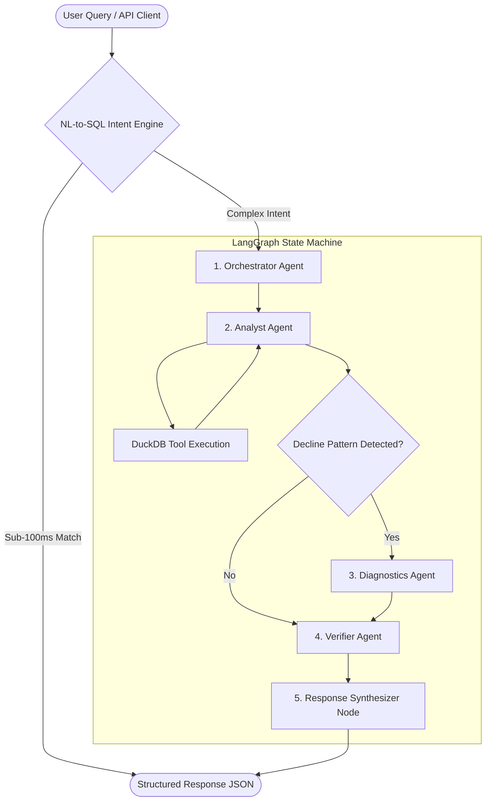

# QuickBite Intelligence — Architecture Specification & Agent Delegation Model

## 1. System Architecture Overview

QuickBite Intelligence is designed as an **evidence-first multi-agent system** utilizing **LangGraph**, **DuckDB**, and **Groq LLM (`llama-3.3-70b-versatile`)**.

The platform adheres to strict engineering constraints:
1. **Zero Hallucination Guarantee**: All numbers, totals, and percentages are computed deterministically via DuckDB SQL engines before reaching the LLM layer.
2. **Defensible Verification Firewall**: The `VerifierAgent` recalculates every metric independently prior to final response rendering.
3. **Observational Analytics**: The platform outputs observational correlations ("Strongest Observed Signals") rather than unverified causal assertions.



---

## 2. Agent Node Roles & Data Contracts

| Agent Node | Primary Responsibility | Input Contract | Output Contract / Execution |
|---|---|---|---|
| **1. OrchestratorAgent** | Intent classification, query categorization (Q1-Q8), date range resolution (`MAX(order_date)`). | Raw User Query | `AnalyticalPlan` (`intent`, `date_range`, `filters`) |
| **2. AnalystAgent** | Maps analytical plan to Python/DuckDB SQL tools and retrieves factual metrics. | `AnalyticalPlan` | Raw Query Results (`dict`) |
| **3. DiagnosticsAgent** | Performs multi-channel signal diagnostics on declining stores and city clusters. | Declining Store Metrics | Ranked Observational Signals |
| **4. VerifierAgent** | Acts as firewall between math and synthesis. Recalculates AOV and MoM percentages. | Raw Tool Metrics | `VerificationStatus` (`passed` / `failed`) |
| **5. ResponseSynthesizer** | Constructs structured JSON adhering to OpenAPI schema specs. | Verified Metrics | `QueryResponse` |

---

## 3. Data Flow & No-Mock Policy

1. **Ingestion Pipeline**: The ETL script `scripts/ingest_dataset.py` parses `QSR_Agentic_Insights_Dataset.xlsx` directly into an embedded, read-only DuckDB instance (`data/qsr.duckdb`) containing 5 relational tables:
   - `Store_Master` (50 Stores, Cities, Formats)
   - `Product_Master` (SKUs, Categories, Veg/Non-Veg)
   - `Orders` (20,000 Orders, Revenue, Channels, Status)
   - `Order_Details` (Line items, Quantities, Line Net Values)
   - `Calendar` (Dates, Months, Weekends, Festive Flags)

2. **Zero Synthetic / Mock Data**: All UI dashboards, charts, and API responses derive directly from real SQL queries executed on `qsr.duckdb`.

---

## 4. End-to-End Execution Trace Example (Evaluation Question 8)

```text
[1] User Query: "Which stores are consistently declining over the last 3 months and why?"
[2] OrchestratorAgent -> Classified intent: 'consistent_store_decline'. Date Range: Last 3 Months (May-July 2026).
[3] AnalystAgent -> Executed get_consistently_declining_stores() on DuckDB.
    -> Returned 9 stores with strictly decreasing monthly revenue (May > June > July).
[4] DiagnosticsAgent -> Evaluated channel performance per store.
    -> Observed Signal: Swiggy delivery segment contributed to 85% of overall revenue drop.
[5] VerifierAgent -> Recalculated MoM decline percentages. Status: Passed.
[6] SynthesizerNode -> Generated structured response:
    - analysis_type: "consistently_declining_stores"
    - insight: "Identified 9 stores with 3-consecutive-month revenue decline..."
    - reasoning_basis: ["Swiggy delivery segment contributed to 85% of revenue drop"]
    - confidence: "high"
```
